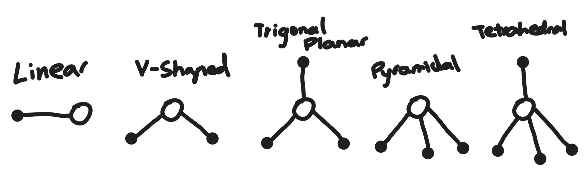
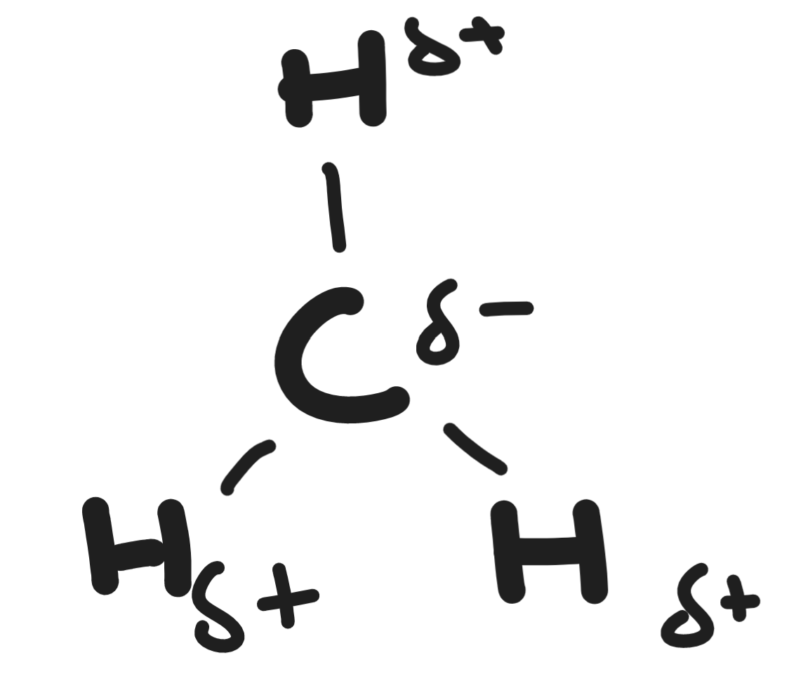
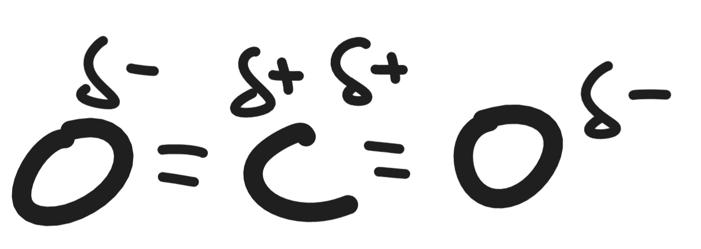
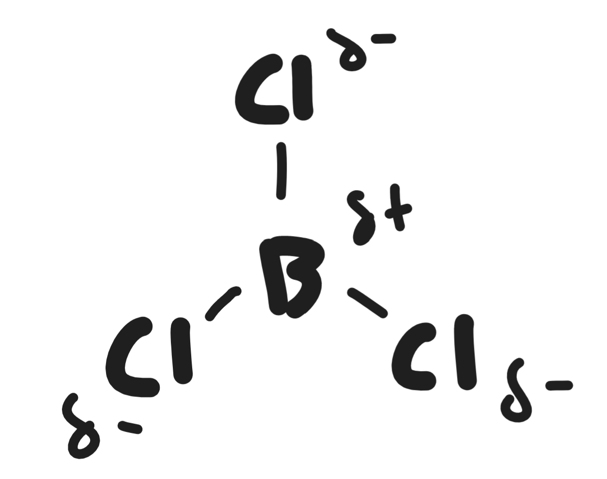
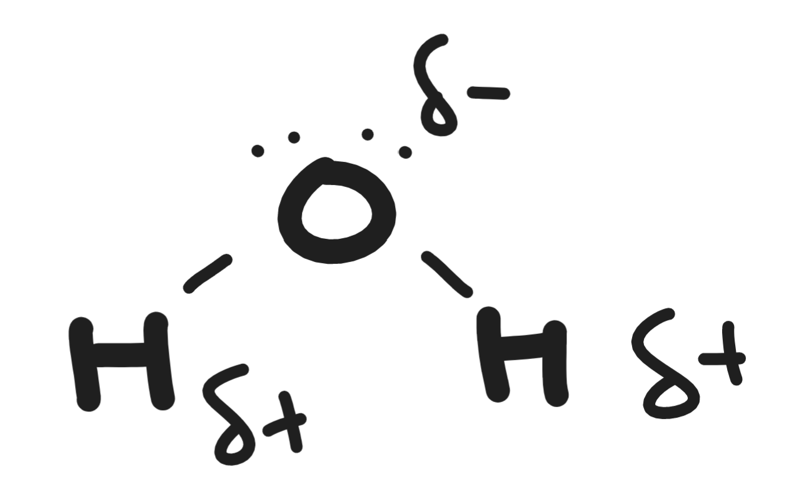
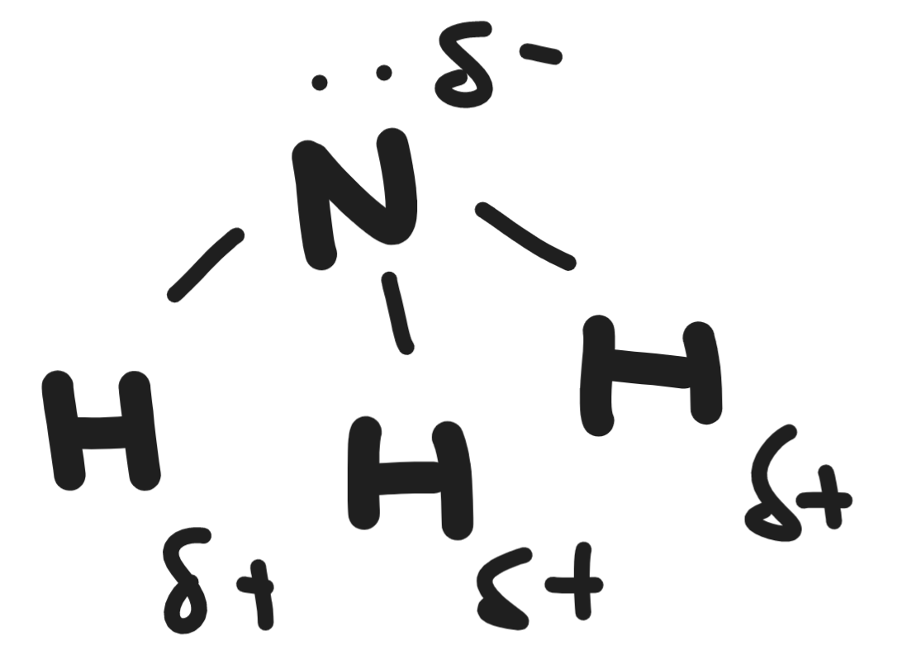

# Shapes of Molecules

There are 5 basic shapes that you should get used to:
- Linear
	- E.g. HCl
- V-shaped
	- E.g. H2O
- Trigonal Planar
	- E.g. CH20 (Methanal)
- Pyramidal
	- E.g. NH3 (Ammonia)
- Tetrahedral
	- E.g. CH4 (Methane)

\* Note: White circles represent a different atom to the black circles

This is due to the **Valence Shell Electron Pair Repulsion Theory** (VSEPR)
- Regions of charge distribute themselves around an atom by repulsion to maximise the distance from each other.

# Non-Polar & Polar Bonds

#### Non-Polar Bond
- Even distribution of charge
- Electrons are shared equally - electrons are "in the middle"

#### Polar Bond
- E.g. Fluorine has a much higher electronegativity
- Electrons are attracted more to it
- There is an uneven charge distribution
- ∴ Polar Bond

### Polarity of Molecules

**To be polar:**
1. There must be at least one bond that is polar
2. Molecule must be non-symmetric

| Shape             | Molecule | Diagram | Polar or Non-Polar | Why?       |
| ----------------- | -------- | ------- | ------------------ | ---------- |
| Tetrahedral       | CH4      |         | Non-Polar          | Symmetric  |
| Linear            | CO2      |         | Non-Polar          | Symmetric  |
| Any Same Molecule | H2       |         | Non-Polar          | Symmetric  |
| Linear            | HCl      |         | Polar              | Asymmetric |
| Trigonal Planar   | BCl3     |         | Non-Polar          | Symmetric  |
| V-Shaped          | H2O      |         | Polar              | Asymmetric |
| Pyramidal         | NH3      |         | Polar              | Asymmetric |
|                   |          |         |                    |            |
